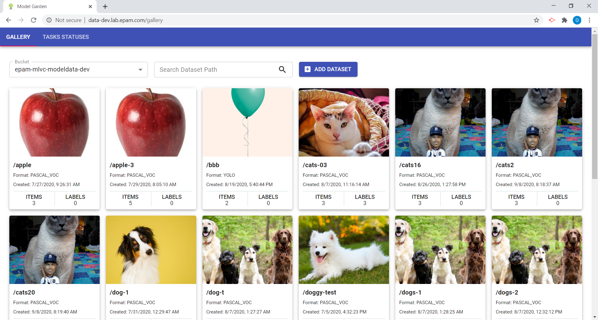
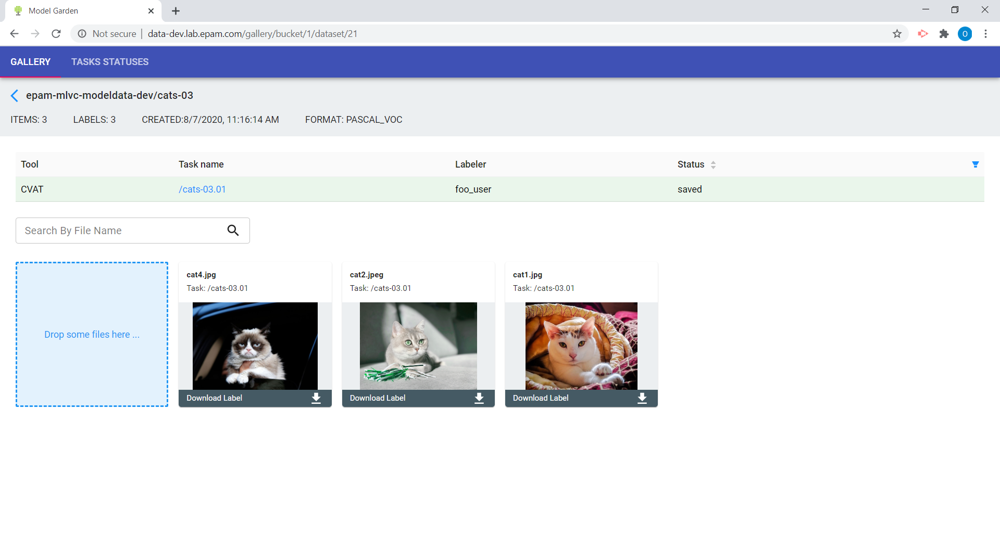
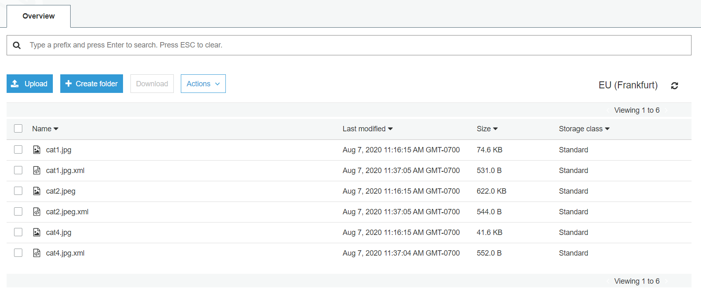
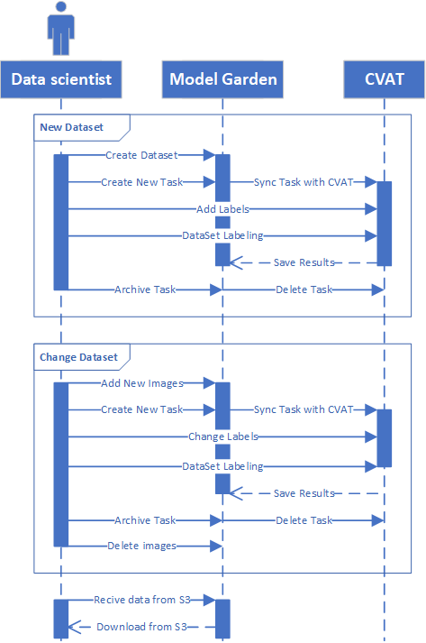
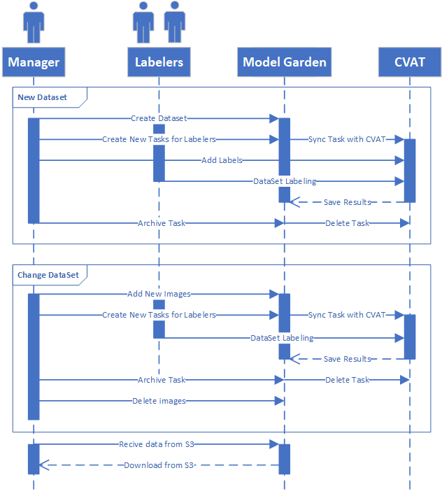
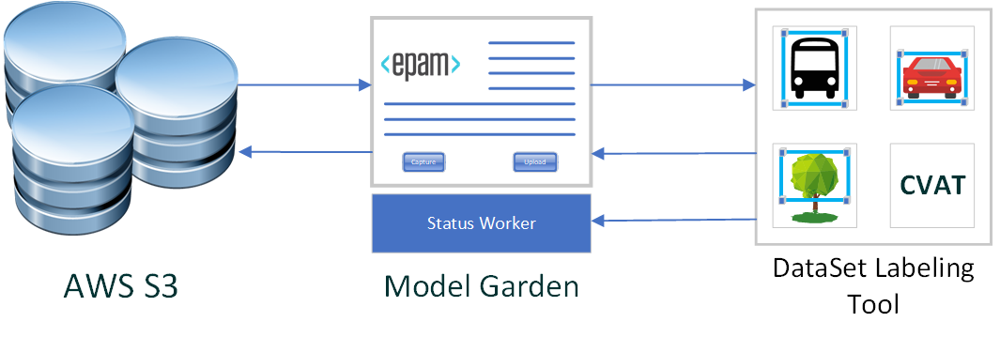

<h2>Model Garden</h2>

## Goals and Prerequisites

**Project Goal**: Provide convenient tool for management of
 [Computer Vision](www.wikipedia.org/wiki/Computer_vision)
 [datasets](www.wikipedia.org/wiki/Data_set) within projects providing numerous
 experiments with visual images.

**Solved Problem**: [Computer Vision](www.wikipedia.org/wiki/Computer_vision)
 projects providing numerous experiments with the image data usually needs
 collaborative sharing of these data and supporting wide range of
 [datasets](www.wikipedia.org/wiki/Data_set) formats.

Among popular image dataset annotation tools
 <a href="www.github.com/opencv/cvat">github.com/opencv/cvat</a> has so far a
 largest number of supported formats ([Pascal VOC](host.robots.ox.ac.uk/pascal/VOC),
 YOLO, [COCO](www.cocodataset.org), etc., see the table
 [below](#existing-solutions)).

<a href="www.github.com/opencv/cvat">Computer Vision Annotation Tool (CVAT)/a>
 open-sourced by <a href="Intel.com">Intel</a> just lucking the support of such
 clouds like [AWS](www.aws.amazon.com). CVAT team has shared a
 <a href="www.github.com/opencv/cvat/issues/863">post</a> saying that the AWS
 "issue in backlog at the moment till we have resources to cover it".

The Model Garden tool is an addition to CVAT providing the following functionality:
 * store in [S3](www.wikipedia.org/wiki/Amazon_S3), reuse and modify image
  datasets using CVAT tool
 * collaborative usage of datasets through web interface
 * prevent labeling tool crash consequences

### Top Existing Solutions

<table style="width:100%">
  <tr>
    <th style="text-align:center">Usage Order</th>
    <th style="text-align:center">Tool</th>
    <th style="text-align:center">Publisher</th>
    <th style="text-align:center">Web</th>
    <th style="text-align:center">Cloud</th>
    <th style="text-align:center">Pascal VOC</th>
    <th style="text-align:center">YOLO</th>
    <th style="text-align:center">COCO</th>
    <th style="text-align:center">MASK</th>
    <th style="text-align:center">TFRecord</th>
    <th style="text-align:center">MOT</th>
  </tr>
  <tr>
    <td>1</td>
    <td><a href="www.github.com/tzutalin/labelImg">ithub.com/tzutalin/labelImg</a></td>
    <td><a href="tzutalin.github.io"><i>private</i></a></td>
    <td style="text-align:center">N</td>
    <td style="text-align:center">N</td>
    <td style="text-align:center">Y</td>
    <td style="text-align:center">Y</td>
    <td style="text-align:center">N</td>
    <td style="text-align:center">N</td>
    <td style="text-align:center">N</td>
    <td style="text-align:center">N</td>
  </tr>
  <tr>
    <td>2</td>
    <td><a href="www.github.com/opencv/cvat">github.com/opencv/cvat</a></td>
    <td><a href="Intel.com">Intel</a></td>
    <td style="text-align:center"><b>Y</b></td>
    <td style="text-align:center"><a href="www.github.com/opencv/cvat/issues/863">N</a></td>
    <td style="text-align:center"><b>Y</b></td>
    <td style="text-align:center"><b>Y</b></td>
    <td style="text-align:center"><b>Y</b></td>
    <td style="text-align:center"><b>Y</b></td>
    <td style="text-align:center"><b>Y</b></td>
    <td style="text-align:center"><b>Y</b></td>
  </tr>
  <tr>
    <td>3</td>
    <td><a href="www.github.com/microsoft/VoTT">github.com/microsoft/VoTT</a></td>
    <td><a href="Microsoft.com">Microsoft</a></td>
    <td style="text-align:center">N</td>
    <td style="text-align:center">Y</td>
    <td style="text-align:center">Y</td>
    <td style="text-align:center"><a href="www.github.com/microsoft/VoTT/issues/803">N</a></td>
    <td style="text-align:center">N</td>
    <td style="text-align:center">N</td>
    <td style="text-align:center">N</td>
    <td style="text-align:center">N</td>
  </tr>
</table>

## Project Support

Model Garden was started as [EPAM Systems](www.epam.com) internal initiative to
support EPAM Computer Vision teams (e.g. 
[Vudoku Accelerator](www.epam.com/careers/blog/vudoku-smart-tv-an-innovative-solution-for-video-content-rotation)). 

The project is open sourced with the support of [epam.github.io](epam.github.io).

## Technical Features

**‍🖌️ Material Design**: **Intuitive** UI based on the world's most widespread
design language.

**🏃 Single Page Application**: Fast, responsive ux to get what you need done
without waiting for full-screen refreshes.

**🐍 Python Django and Postgres**

**🏷 AWS S3 DataSet Gallery**

## Use Cases

### Model Prototyping

Model Garden supports case when with only one data scientist works on the
 project (does labeling and ML training). This can be useful for experimental
 projects.

### Collaborative DataSet Labeling

Model Garden supports the case of Massive parallel labeling when a manager has a
 lot of images and a list of labels. In this case, the manager can upload
 DataSet, create a list of labels, and assign certain DataSet parts to different
 labelers, and next control their work.

## DataFlow

Material Garden is a mediator between CVat (one of the most popular open-source
 annotation tool for computer vision) and Amazon S3 (object storage service).

Status Worker is part of Material Garden. This worker checks event updates from
 CVAT asynchronously.

## CI/CD

The example of [Continuous Deployment](https://en.wikipedia.org/wiki/Continuous_deployment)
 to the cloud container registry as well as the cloud update is set with help of
 [GitLab CI/CD](docs.gitlab.com/ee/ci/) [.gitlab-ci.yml](.gitlab-ci.yml) file.

## Installation

### Installation Specifications
- [CVAT Installation Guide](cvat/README.md)
- See installation steps for backend developers in
 [<model_garden_root>/backend/README.md](backend/README.md)
- See installation steps for frontend developers in
 [<model_garden_root>/frontend/README.md](frontend/README.md)

### Deployment

See all the details in the [<model_garden_root>/deploy/README.md](deploy/README.md).

If [CI/CD](https://en.wikipedia.org/wiki/CI/CD) is set via
 [.gitlab-ci.yml](.gitlab-ci.yml) the build pipeline is started automatically
 after commits to **master** and **develop** branches

### Contacts

* <a href="mailto:OrgCompetencyComputerVisionServiceDesk@epam.com">Model Garden Initiative DL</a>
* <a href="mailto:OrgOpenSourceRelease@epam.com">EPAM Open Source Community</a> 
