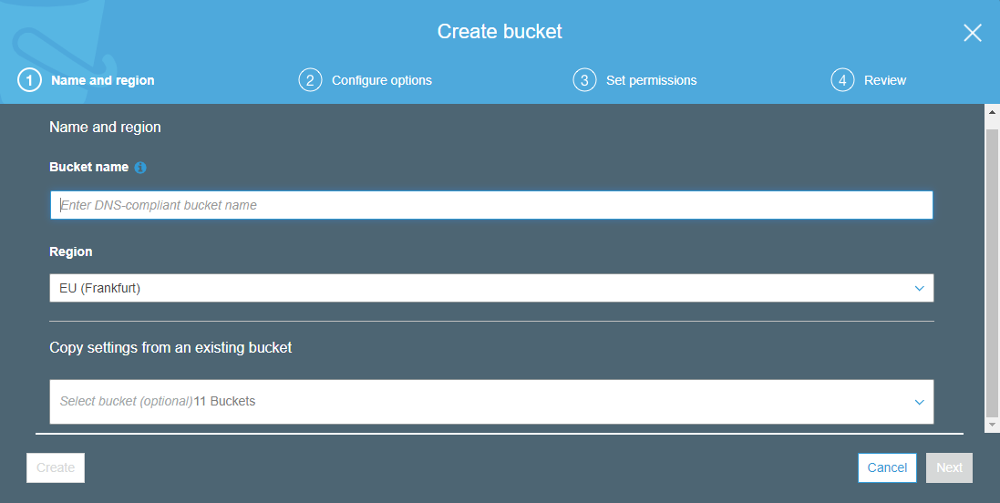
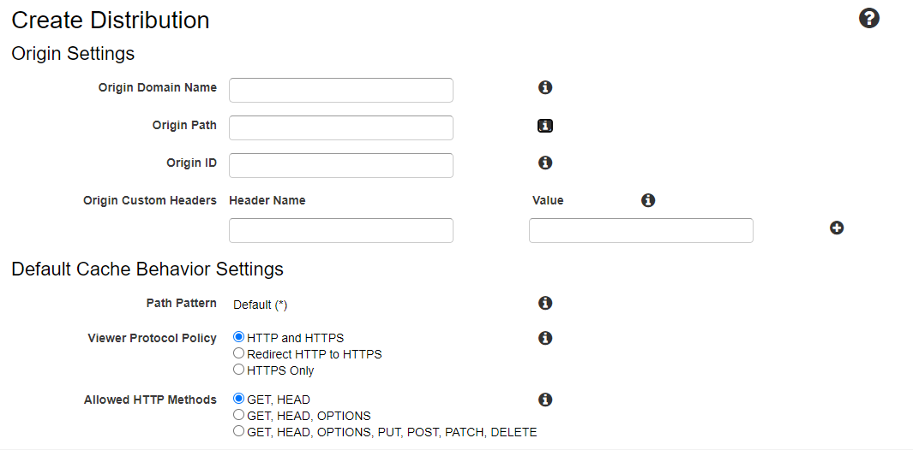
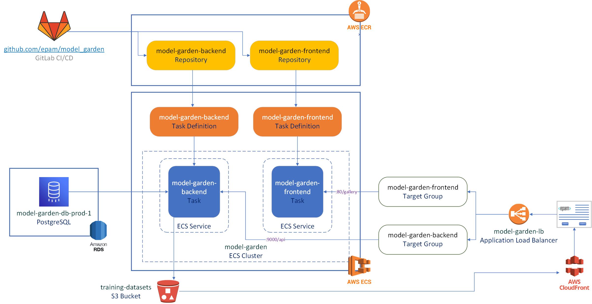

# Deployment

## Model Garden Deployment Guide

### Setup S3 Bucket
1. To setup bucket go to S3 console and click on Create new bucket button.




2. Most convenient way to establish new bucket it to copy another and this
option on present screen. However, it can be first bucket.

In this case enter future DNS name for bucket and do not make any additional
changes and keep public access in the access configuration.


### Create CloudFront Distribution

1. Find this service in list of Amazon services and click on Create distribution
 button.
2. On next step choose Web Distribution.
3. Configuration page will be shown on the `Create Distribution` screen:



4. To start configuration click on Origin Domain Name and you will see list of
 available S3 buckets.
5. Select newly created bucket from list. After that Origin ID will be updated
 automatically.
6. Restrict bucket access(yes), origin access identity(create new identity).
 Read permissions should be applied later. In this case after creation you will
 be able to reflect properly changes in S3.
7. Finish configuration without further changes and create CDN.

It will take some take to deploy new CDN.

## Add Backend .env File
See [Add Backend .env File](../backend/README.md#add-backend-env-file) in
 [backend/README.md](../backend/README.md).

### Add Front-end .env File
See [Add Backend .env File](../backend/README.md#add-backend-env-file) in
 [backend/README.md](../backend/README.md).

### Run Application with Docker Compose
```
$ docker-compose up -d

Creating network "model_garden_default" with the default driver
...
Creating model_garden_postgres_1 ... done
Creating model_garden_backend_1  ... done
Creating model_garden_frontend_1 ... done
```

### Check Running Docker Containers
```
$ docker-compose ps

         Name                        Command               State           Ports         
-----------------------------------------------------------------------------------------
model_garden_backend_1    bash -c ./manage.py migrat ...   Up      0.0.0.0:9000->9000/tcp
model_garden_frontend_1   /bin/sh -c nginx -g 'daemo ...   Up      0.0.0.0:80->80/tcp    
model_garden_postgres_1   docker-entrypoint.sh postgres    Up      0.0.0.0:5444->5432/tcp
```

### AWS Cloud Deployment

#### Overview

Model Garden Project can be automatically deployed with help of 
 [GitLab CI/CD](docs.gitlab.com/ee/ci/) [.gitlab-ci.yml](../.gitlab-ci.yml) file,
 if the following AWS components are configured:
 * AWS RDS Postgres instance
 * Backend Task Definition (from
  [<model_garden_root>/backend/Dockerfile](../backend/Dockerfile) docker)
 * Frontend Task Definition (from
  [<model_garden_root>/frontend/Dockerfile](../frontend/Dockerfile) docker)
 * model-garden ECR Cluster with model-garden-backend and model-garden-frontend
  AWS Fargate services created using backend and frontend Task Definitions  
 * [Application Load Balancer](www.aws.amazon.com/elasticloadbalancing)
 
 

#### Backend Task Definition

Backend Task Definition should contain the 2 containers.

##### Backend Container Definition

<table style="width:100%">
  <tr>
    <th>Name</th>
    <th>Value</th>
  </tr>
  <tr>
    <td>Container Name</td>
    <td>backend</td>
  </tr>
  <tr>
    <td>Entry point</td>
    <td>"sh","-c"</td>
  </tr>
  <tr>
    <td>Command</td>
    <td>"./manage.py migrate && ./manage.py runserver 0.0.0.0:9000"</td>
  </tr>
  <tr>
    <td>Host Port</td>
    <td>9000</td>
  </tr>
</table>

##### Worker Container Definition

Worker container performs continues synchronization with CVAT in an infinite loop.

<table style="width:100%">
  <tr>
    <th>Name</th>
    <th>Value</th>
  </tr>
  <tr>
    <td>Container Name</td>
    <td>worker</td>
  </tr>
  <tr>
    <td>Entry point</td>
    <td>"sh","-c"</td>
  </tr>
  <tr>
    <td>Command</td>
    <td>"./worker.py"</td>
  </tr>
  <tr>
    <td>Host Port</td>
    <td><i>n/a</i></td>
  </tr>
</table>

#### Frontend Task Definition

Frontend is running as demon within the current container. Thus there is no need
 to launch any process at the frontend container start.

<table style="width:100%">
  <tr>
    <th>Name</th>
    <th>Value</th>
  </tr>
  <tr>
    <td>Container Name</td>
    <td>frontend</td>
  </tr>
  <tr>
    <td>Entry point</td>
    <td>"sh","-c"</td>
  </tr>
  <tr>
    <td>Command</td>
    <td><i>n/a</i></td>
  </tr>
  <tr>
    <td>Host Port</td>
    <td>80</td>
  </tr>
</table>
